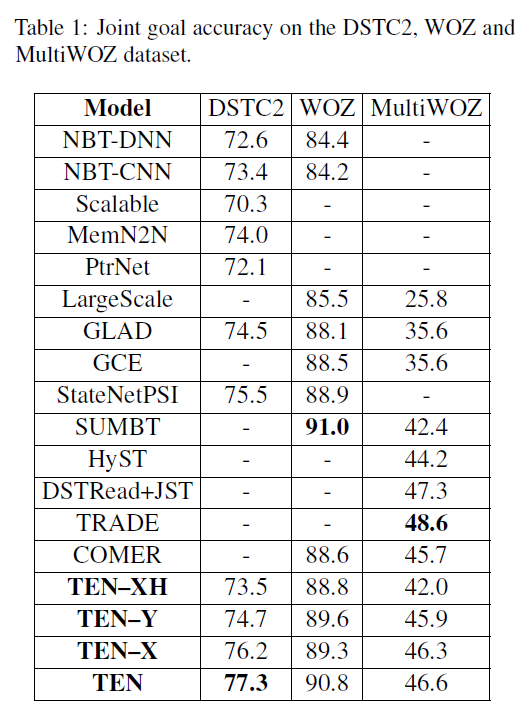

# TEN_EMNLP2020
The code and data for the Findings of EMNLP 2020 paper: [Neural Dialogue State Tracking with Temporally Expressive Networks](https://arxiv.org/pdf/2009.07615.pdf)

## Description
Existing Dialogue state tracking (DST) models either ignore __temporal feature dependencies__ across dialogue turns (__Explicit Tracking models__, such as NBT (Mrksic et al., 2017) and GLAD (Zhong et al., 2018)) or fail to explicitly model __temporal state dependencies__ in a dialogue (__Implicit Tracking models__, such as (Henderson et al., 2014; Mrksic et al., 2015; Ren et al., 2018; Ramadan et al., 2018; Lee et al., 2019)). In this work, we propose Temporally Expressive Networks (TEN) to jointly model the two types of temporal dependencies in DST. The TEN model utilizes the power of __hierarchical recurrent networks__ and probabilistic graphical models (__factor graphs__). The structures of the Explicit Tracking models, the Implicit Tracking models and our proposed model are presented in Figure 1.

  

One of the insights in this work is that when a hard decision is made on the soft-label, the errors it creates may propagate to future turns, resulting in errors in future state aggregation. We insist that the soft-label of Y layer and X layer should be maintained, so that the uncertainties in state aggregation can be kept in modeling. Thus we propose a state aggregation approach based on the factor graphs and handle with these uncertainties using the belief propagation. The factor graphs for state aggregation is shown in Figure 2.

  

The main experimental results are presented in Table 1. Besides the results of previous works, we also report the results of the ablated models TEN-XH, TEN-X and TEN-Y. The proposed TEN model has demonstrated to be effective in standard DST datasets (including DSTC2, WOZ and MultiWOZ). TEN became the new state-of-the-art model on the DSTC2 dataset and a state-of-the-art comparable model on the WOZ dataset. But the limitation of TEN as well as most of the DST models building upon a pre-defined ontology (such as NBT, GLAD, SUMBT) is that they have trouble applying to multi-domain DST, comparing to models specifically designed for the multi-domain setting (such as HyST (Goel et al., 2019), DSTRead (Gao et al., 2019), and TRADE (Wu et al., 2019)). For more details, the readers can refer to the [paper](https://arxiv.org/pdf/2009.07615.pdf).

  

## Datasets
The datasets used in this paper include DSTC2, WOZ and MultiWOZ. All of the 3 datasets are publicly available. Here we provide the processed version of the 3 datasets. You can download the zipped datasets "__data.zip__" from the [Google Drive](https://drive.google.com/drive/folders/1iLlsd5BeTmbuyuLWus4rJeCx5HMI6ocd?usp=sharing) or the [Baidu Cloud](https://pan.baidu.com/s/1p78h0LMT1YmZMxIMB8IpOA) (access code: iqp7). If you use a new dataset, you should first transform the data format as the same as the __.json__ file in ./data/DSTC2/raw, then process it by running __preprocess_data.py__.

## Training and Evaluation
+ Unzip the processed data into the "__data__" directory.
+ Configurate the models in the __config.py__. The default configurations for TEN-XH,TEN-X,TEN-Y and TEN are provided but commented. If you want to use the default configurations, just __uncomment the corresponding lines__. Note that the TEN model is initialized by a pre-trained TEN-X model, so before you run the TEN model, you should first run a TEN-X model and set the "__args\['resume'\]__" in the config.py.
+ Training: use the command __sh run.sh__ to run the models.
+ Test: use the command __sh test.sh__ to evaluate the models.

## References
[Henderson et al., 2014] Matthew Henderson, Blaise Thomson and Steve J. Young. Word-Based Dialog State Tracking with Recurrent Neural Networks. In SIGDIAL 2014.

[Mrksic et al., 2015] Nikola Mrksic, Diarmuid O Seaghdha, Blaise Thomson, Milica Gasic, Pei-hao Su, David Vandyke, Tsung-Hsien Wen and Steve J. Young. Multi-domain Dialog State Tracking using Recurrent Neural Networks. In ACL 2015.

[Mrksic et al., 2017] Nikola Mrksic, Diarmuid O Seaghdha, Tsung-Hsien Wen, Blaise Thomson and Steve J. Young. Neural Belief Tracker: Data-Driven Dialogue State Tracking. In ACL 2017.

[Zhong et al., 2018] Victor Zhong, Caiming Xiong and Richard Socher. Global-Locally Self-Attentive Dialogue State Tracker. In ACL 2018.

[Ren et al., 2018] Liliang Ren, Kaige Xie, Lu Chen and Kai Yu. Towards Universal Dialogue State Tracking. In EMNLP 2018.

[Ramadan et al., 2018] Osman Ramadan, Pawel Budzianowski and Milica Gasic. Large-Scale Multi-Domain Belief Tracking with Knowledge Sharing. In ACL 2018.

[Lee et al., 2019] Hwaran Lee, Jinsik Lee and Tae-Yoon Kim. SUMBT: Slot-Utterance Matching for Universal and Scalable Belief Tracking. In ACL 2019.

[Goel et al., 2019] Rahul Goel, Shachi Paul and Dilek Hakkani-Tur. HyST: A Hybrid Approach for Flexible and Accurate Dialogue State Tracking. In Interspeech 2019.

[Gao et al., 2019] Shuyang Gao, Abhishek Sethi, Sanchit Agarwal, Tagyoung Chung and Dilek Hakkani-Tur. Dialog State Tracking: A Neural Reading Comprehension Approach. In SIGdial 2019.

[Wu et al., 2019] Chien-Sheng Wu, Andrea Madotto, Ehsan Hosseini-Asl, Caiming Xiong, Richard Socher and Pascale Fung. Transferable Multi-Domain State Generator for Task-Oriented Dialogue Systems. In ACL 2019.
