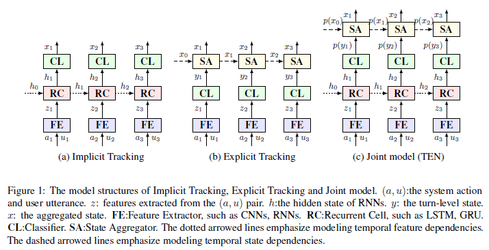
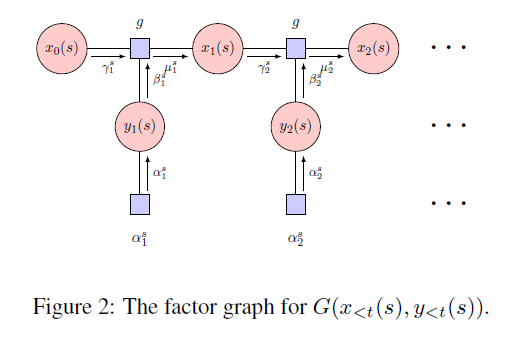

# TEN_EMNLP2020
The code and data for the Findings of EMNLP 2020 paper: [Neural Dialogue State Tracking with Temporally Expressive Networks](https://arxiv.org/pdf/2009.07615.pdf)

## Description
Existing Dialogue state tracking (DST) models either ignore temporal feature dependencies across dialogue turns (Explicit Tracking models, such as NBT (Mrksic et al., 2017) and GLAD (Zhong et al., 2018)) or fail to explicitly model temporal state dependencies in a dialogue (Implicit Tracking models, such as (Henderson et al., 2014; Mrksic et al., 2015; Ren et al., 2018; Ramadan et al., 2018; Lee et al., 2019)). In this work, we propose Temporally Expressive Networks (TEN) to jointly model the two types of temporal dependencies in DST. The TEN model utilizes the power of hierarchical recurrent networks and probabilistic graphical models (factor graphs). The structures of the Explicit Tracking models, the Implicit Tracking models and our proposed model are presented in Figure 1.

  

One of the insights in this work is that when a hard decision is made on the soft-label, the errors it creates may propagate to future turns, resulting in errors in future state aggregation. We insist that the soft-label of Y layer and X layer should be maintained, so that the uncertainties in state aggregation can be kept in modeling. Thus we propose a state aggregation approach based on the factor graphs and handle with these uncertainties using the belief propagation. The factor graphs for state aggregation is shown in Figure 2.

  

## References
[Henderson et al., 2014] Matthew Henderson, Blaise Thomson and Steve J. Young. Word-Based Dialog State Tracking with Recurrent Neural Networks. In SIGDIAL 2014.

[Mrksic et al., 2015] Nikola Mrksic, Diarmuid O Seaghdha, Blaise Thomson, Milica Gasic, Pei-hao Su, David Vandyke, Tsung-Hsien Wen and Steve J. Young. Multi-domain Dialog State Tracking using Recurrent Neural Networks. In ACL 2015.

[Mrksic et al., 2017] Nikola Mrksic, Diarmuid O Seaghdha, Tsung-Hsien Wen, Blaise Thomson and Steve J. Young. Neural Belief Tracker: Data-Driven Dialogue State Tracking. In ACL 2017.

[Zhong et al., 2018] Victor Zhong, Caiming Xiong and Richard Socher. Global-Locally Self-Attentive Dialogue State Tracker. In ACL 2018.

[Ren et al., 2018] Liliang Ren, Kaige Xie, Lu Chen and Kai Yu. Towards Universal Dialogue State Tracking. In EMNLP 2018.

[Ramadan et al., 2018] Osman Ramadan, Pawel Budzianowski and Milica Gasic. Large-Scale Multi-Domain Belief Tracking with Knowledge Sharing. In ACL 2018.

[Lee et al., 2019] Hwaran Lee, Jinsik Lee and Tae-Yoon Kim. SUMBT: Slot-Utterance Matching for Universal and Scalable Belief Tracking. In ACL 2019.

